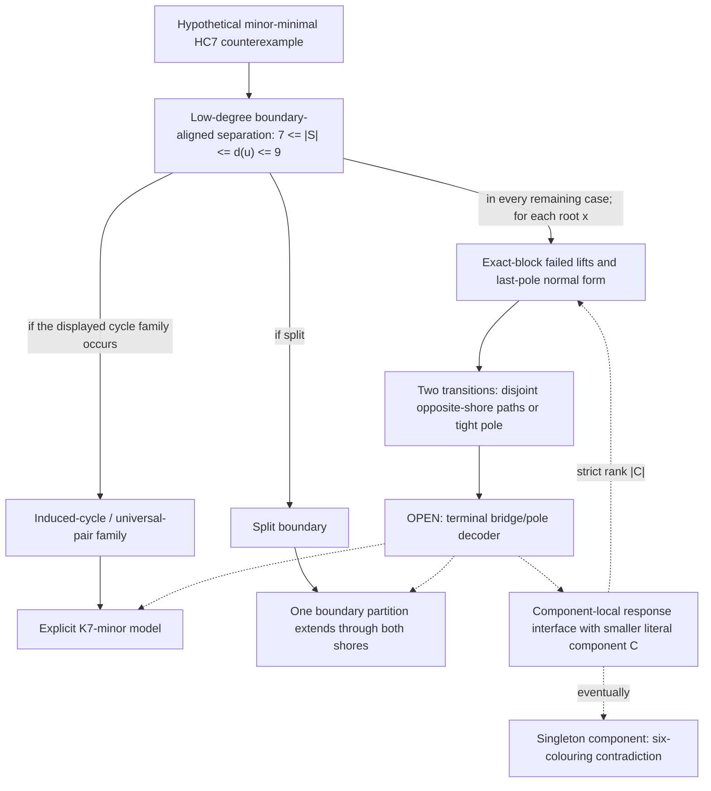
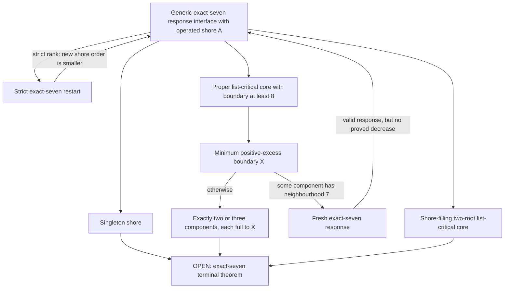

# Verification map for the live `HC_7` programme

**Status:** verification map, not a new theorem.  Every mathematical arrow
below is either linked to an audited result or marked open.  This file makes
the exhaustiveness and descent obligations explicit; it does not prove
`HC_7`.

## 1. Conventions

- A **terminal** arrow constructs a `K_7`-minor model or one boundary
  equality partition realized by both closed shores, and therefore
  contradicts the hypothetical counterexample.
- A **strict recursive** arrow returns to the same stated class in the same
  host graph while decreasing a named quantity measured on literal vertices
  of the host graph.
- A **fresh response** arrow returns a valid colouring obstruction but does
  not preserve enough data, or does not prove a decrease, to be used as an
  induction step.
- A finite classification is never treated as an unbounded arrow unless an
  audited reduction places every instance in that finite class.

## 2. The exhaustive all-degree chain

Let `G` be a minor-minimal counterexample to `HC_7`.  The audited
[low-degree adjacent-pair theorem](../results/hc7_low_degree_adjacent_pair_alignment.md)
gives a vertex `u` of degree seven through nine and a bounded full
separation at every component of `G-N[u]`.  The audited
[component-uniform alignment theorem](../results/hc7_component_uniform_boundary_alignment.md)
gives, for every such component `C`, a vertex `z_C in S=N_G(C)` such that

\[
 7\le d_G(u)\le9,
 \qquad 7\le |S|\le d_G(u),
 \qquad \chi(G-\{u,z_C\})=6.
\]

The graphs `G[C\cup S]` and `G-C` form an actual separation.  The connected
subgraph `C` and the singleton `{u}` are each adjacent to every vertex of
`S`; `G[S]` is four-colourable; both closed shores realize every nonempty
independent set of `G[S]` as an exact boundary colour class; and the edge
deletion `G-uz` supplies a named response rejected by the intact opposite
shore.



The split-boundary terminal is proved in
[`hc7_split_boundary_synchronization.md`](../results/hc7_split_boundary_synchronization.md).
The displayed cycle family is closed by the
[cycle-boundary completion theorem](../results/hc7_cycle_boundary_completion.md)
and its bounded-interface applications.  In all cases, the
[exact-block Kempe reduction](../results/hc7_bounded_interface_exact_block_kempe_reduction.md)
returns literal failed-lift paths with bounded boundary-contact defect.  The
audited
[last-pole normal form](../results/hc7_bounded_interface_pole_move_normal_form.md)
makes a final response pole-free unless it has one exact five-block/six-block
form.  The audited
[two-transition theorem](../results/hc7_bounded_interface_two_transition_disjoint_response.md)
uses the endpoint nonedge of a first `C`-path as the exact block for a second
transition.  It produces vertex-disjoint paths in opposite open shores with
disjoint boundary nonedges, or the tight pole residue.  In the path case a
`K_6` minor in the boundary augmented by those two nonedges lifts to an
explicit `K_7` model, so the surviving augmented boundary is necessarily
`K_6`-minor-free.

The paths need not arise from one colouring operation, and neither the
`K_6`-minor-free augmented-boundary case nor the tight pole case is terminal.
The audited
[pole-star barrier](../barriers/hc7_opposite_shore_shortest_transition_pole_barrier.md)
shows that local exact-block responses, all pole-star deletions,
shortest-transition minimality and seven-connectivity do not eliminate the
second case.  It lacks global `K_7`-minor exclusion and full proper-minor
criticality, which are therefore the remaining available host-level inputs.

The dashed arrows are precisely the open
[pole-free bridge composition theorem](hc7_bounded_interface_synchronization_frontier.md#4-primary-open-theorem).
Its third outcome must return an actual component `D` with `|D|<|C|`.
Component-uniform alignment then supplies a new named edge `uz_D`; the old
boundary vertex need not be preserved.  Selecting `C` initially with maximum
order isolates the nonrecursive path case to components tied with `C` in
order and the at most two vertices of `N(u)-S`.  A terminal singleton
component is impossible.  Consequently this one open theorem, together
with the audited entry, would prove `HC_7`.

This is the only currently justified exhaustive case DAG for all three
possible degrees.  It is important not to replace it by the more detailed
order-eight or order-nine diagrams below: those are conditional descendants,
not exhaustive entry theorems for arbitrary original degree-eight or
degree-nine vertices.

## 3. Degree-seven refinement

When `d_G(u)=7`, necessarily `S=N(u)` and `G-N[u]` is one connected
component.  The audited degree-seven machinery produces a boundary-labelled
model of `K_7` with one missing adjacency or two adjacent missing
adjacencies.  Failed model repairs produce actual full-neighbourhood
separations.  Whenever an actual order-seven separation has a selected
crossing-edge deletion response, the
[generic exact-seven restart theorem](../results/hc7_generic_exact7_response_restart.md)
gives exactly four outcomes.



The minimum positive-excess normal form is the audited theorem
[`hc7_minimum_positive_separator_normal_form.md`](../results/hc7_minimum_positive_separator_normal_form.md).
Its exact-seven return is a **fresh response**, not a strict recursive
arrow: the theorem expressly does not prove that the returned shore is
smaller than the previously selected shore.  This is the principal cycle
in the fine-grained programme.

The three presently open terminal modes are:

1. a singleton operated shore, whose surviving opposite exterior is
   nonbipartite and two-connected after the proved bridge and cutvertex
   reductions;
2. a proper core whose minimum positive-excess boundary has two or three
   boundary-full complementary components; and
3. a shore-filling positive-excess list-critical core.  The all-tight
   multiblock subfamily of the third mode is closed, but positive total
   list-degree excess remains unbounded.

The exact target for these modes is stated in the
[degree-seven technical frontier](hc7_degree7_model_separator_frontier.md#generic-exact-seven-restart-and-the-remaining-terminal-theorem).
It must construct an explicit `K_7`-minor model, return an exact order-seven
separation with one common complete boundary equality partition, or return
a strictly smaller generic exact-seven interface.

## 4. Where the order-eight and order-nine results attach

The developed order-eight and order-nine theorems attach only after the
proper-core positive-excess branch above has supplied additional selected
responses and full-component structure.

| Developed branch | Required entry data | What is proved | What is not proved |
|---|---|---|---|
| Minimum positive-excess boundary | A proper exact-seven list-critical core and a minimum eligible boundary of order at least eight | Either a fresh exact-seven response, or exactly two or three complementary components full to the boundary | A strict return to the former exact-seven shore; a common boundary partition |
| Order-eight component analysis | The selected response, a full order-eight boundary, and the relevant component/label hypotheses | Many path, cutvertex, two-cut, and labelled subfamilies terminate or descend | That every original degree-eight entry reaches one of these subfamilies |
| Order-nine spanning list-critical endpoint | A two-full-shore positive-excess descendant, a fixed exact block, a shortest transition, and exclusion of proper list-critical kernels | Boundaries of order at least ten reduce; the surviving paired-kernel boundary has order nine; its colouring transition has a short normal form | That every original degree-nine entry reaches this endpoint; a host-level terminal or strict labelled descent |

In particular, there is no proved arrow

```text
arbitrary low-degree entry with d(u)=8 or 9
    -> developed order-eight or order-nine positive-excess endpoint.
```

The [large-boundary singleton-response theorem](../results/hc7_large_boundary_singleton_response_descent.md)
also needs a scope qualification.  A proper list-critical kernel returns a
smaller connected response side, but with an uncontrolled boundary, a fresh
trace and no preserved minor-model labels.  That is useful host-level
compression, not by itself a recursive arrow in the labelled programme.

## 5. Arrow ledger

| Arrow | Preserved literal data | Rank | Status |
|---|---|---|---|
| Hypothetical counterexample to low-degree interface | Fixed host `G`; `u,C,S`; actual separation; two boundary-full connected subgraphs; a component-specific edge-deletion response `uz_C` for every `C` | none needed | proved and audited |
| Split boundary to common partition | Literal boundary and both extension languages | terminal | proved and audited |
| Cycle-boundary family to `K_7` | Two universal vertices, induced cycle, connected full shores | terminal | proved and audited |
| Exact-block transition to failed-lift path | Boundary root, selected edge deletion, exact block, literal path and first hits | none | proved and audited |
| Last pole move to a pole-free path or the tight pole residue | Exact final trace, moved vertex, merged independent block, operation colours and all final opposite-shore extensions | none | proved and audited |
| Two exact-block transitions to disjoint opposite-shore paths or the tight pole residue | Literal boundary nonedges, paths and shore ownership; operation provenance remains separate | none | proved and audited; the path survivor has `K_6 not minor G[S]+e+f` |
| Disjoint paths or tight pole to global conclusion | Must preserve the displayed path or pole labels and return an actual anti-neighbourhood component; its response is regenerated component-locally | required decrease `|C'|<|C|` in recursive outcome | **open; relative to the entry reduction this is `HC_7`-strength** |
| Exact-seven proper core with boundary seven to restart | Fixed host, new literal seven-boundary, selected crossing edge and one operation-specific colouring | smaller connected operated shore | proved and audited |
| Minimum positive-excess boundary to exact-seven response | Fixed host and a fresh selected response | no decrease proved | proved response; **not** an induction arrow |
| Minimum positive-excess boundary to two/three full components | Fixed host, literal minimum boundary, operation-specific exclusive responses | minimum boundary is a normalization, not a recursive rank | proved and audited normal form; terminal coupling open |
| Proper kernel in the order-nine paired branch to a fresh response side | Fixed host and a new obstruction colouring | smaller connected set, but boundary and labels uncontrolled | proved compression; **not** an allowed labelled recursion |

## 6. Verification conclusion

The repository contains substantial unbounded reductions and several
complete infinite-family closures.  It does not yet contain a well-founded
fine-grained induction covering all live branches.  There are two honest
ways to state the remaining frontier:

1. globally, prove the pole-free bridge composition theorem, which is
   sufficient for `HC_7` relative to the audited entry reduction; or
2. in the degree-seven refinement, prove a host-level response-coupling
   theorem that simultaneously closes the singleton, positive-excess and
   shore-filling modes and makes every nonterminal exact-seven return
   strictly smaller.

The second target is narrower in hypotheses and a better laboratory for a
new mechanism.  The first target is the exhaustive global obligation and
must remain visible when assessing whether the programme is converging.
